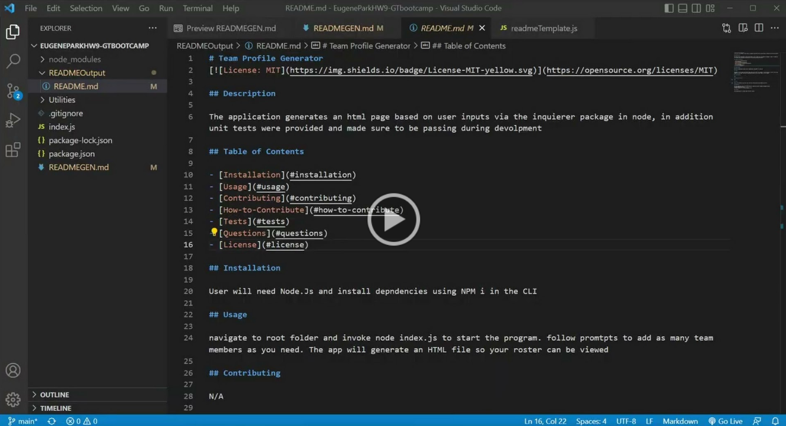

# CLI Readme Generator

## Description

This application generates a professional README through the use of Command line Prompt.

please see the application overview below

## Table of Contents

- [Installation](#installation)
- [Usage](#usage)
- [Contributing](#contributing)
- [How-to-Contribute](#how-to-contribute)
- [Tests](#tests)
- [Questions](#questions)
- [License](#license)

## Installation

Clone Repo from github into machine, ensure node.js is installed, run node index.js in the CLI to run program.

## Usage

enter node index.js in the CLI and follow the prompts, the generated readme will be outputted into the  READMEOutput folder in the main directory

## Contributing

N/A

## How-to-contribute

N/A

## Tests

TBD

## Questions

For any questions refer to the magicCrouton repository https://github.com/MagicCrouton/NodePoweredReadMEGenerator 
or email inqueries to e.park5336@gmail.com

## License

This application is covered under the MIT license